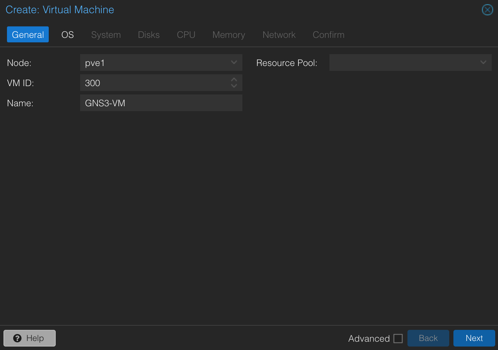
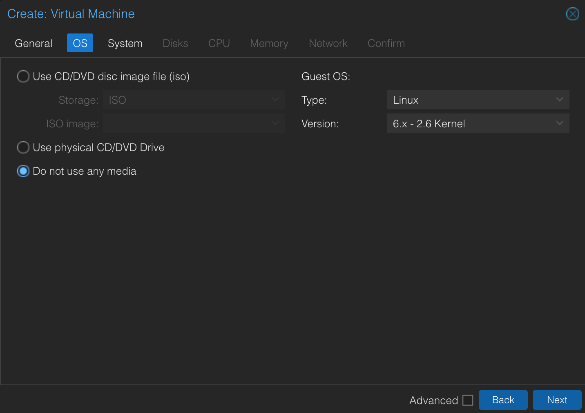
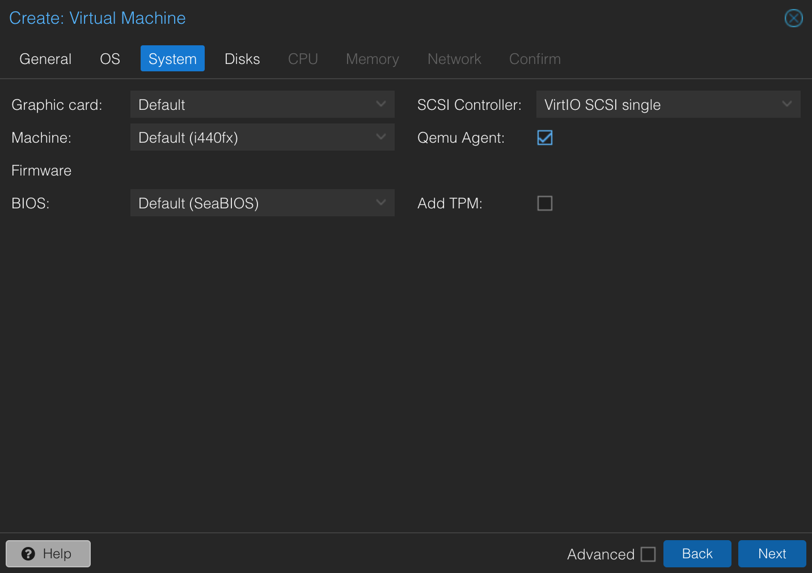
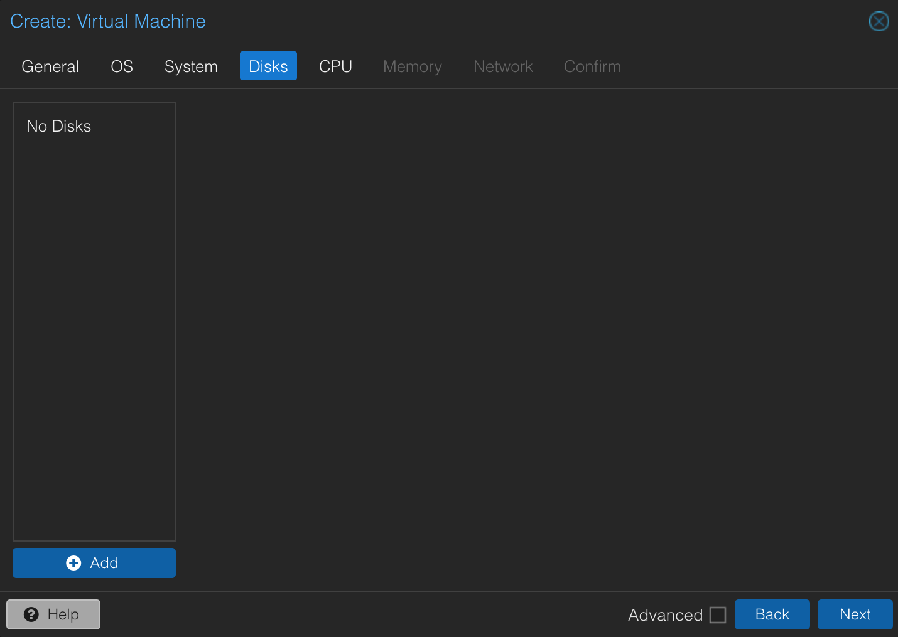
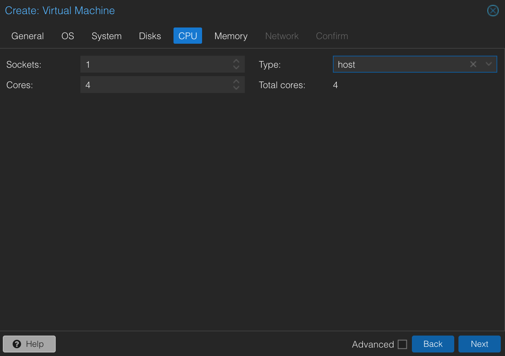
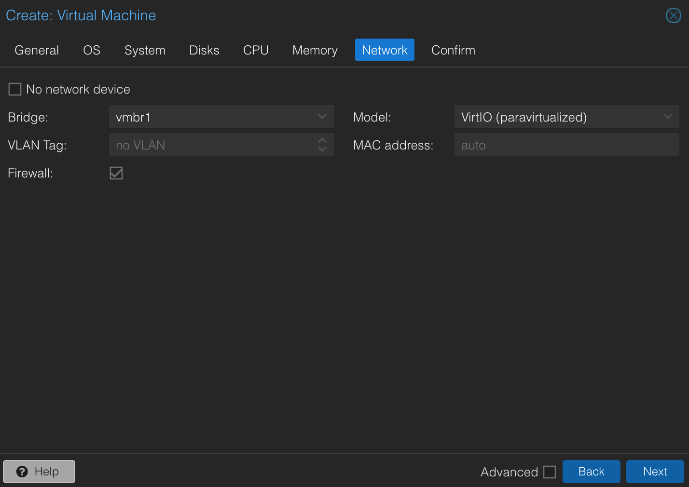
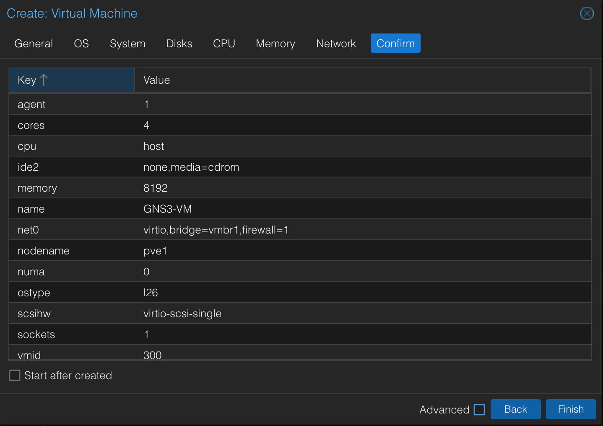
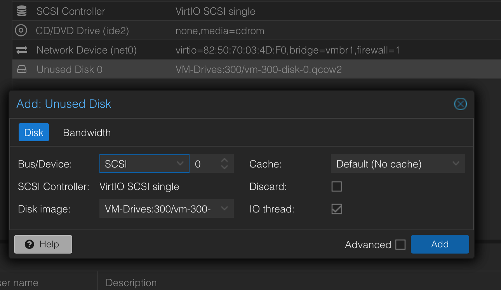
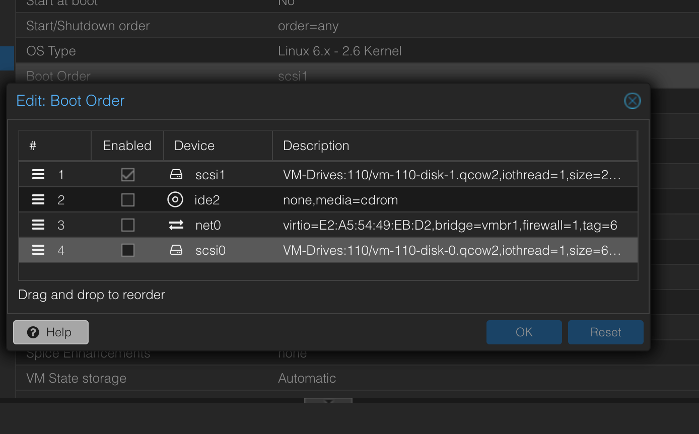
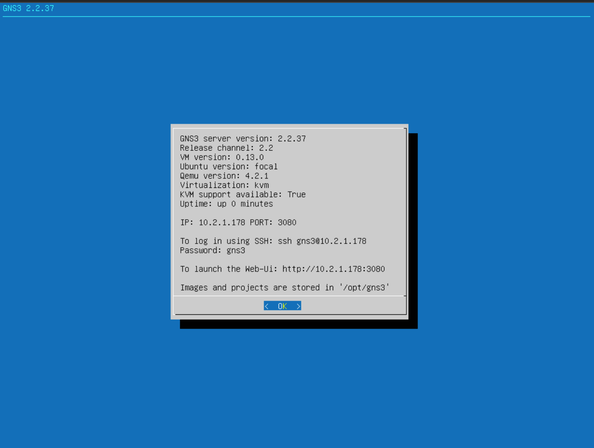

# How to install GNS3 VM on Proxmox
#GNS3 #Networking #Proxmox

[Documentation](https://quibtech.com/p/gns3-vm-in-proxmox-ve/)


## Download VMware EXSi GNS3 VM 
Available on https://gns3.com/software/download-vm

1. Copy the url from the Download link. 
2. Open up the console on your proxmox node. From the root directory run:
```bash
wget https://github.com/GNS3/gns3-gui/releases/download/v2.2.42/GNS3.VM.VMware.ESXI.2.2.42.zip
```

3. Unzip the file:
```
unzip GNS3.VM.VMware.ESXI.2.2.42.zip
```
## Extract the contents of the .ova file
```bash
tar -xvf *.ova
```

You should be left with these files:
- `GNS3 VM-disk001.vmdk`
- `GNS3 VM-disk002.vmdk`
- `GNS3 VM.ovf`

## Create a new VM
1. Give it a name and ID


2. Because in this case we will be importing preconfigured VM, we don't need an OS image. Select "Do not use any media" and continue.


3. For it to work, It is important that the select the following settings:


4. Since we will be importing the previously downloaded disk, we don't need to create any disks for this VM.


5. GNS3 is requires processing power. Allow as many cores as possible in your system. (IMPORTANT!) select `host` in the "Type" dropdown menu. This is how we enable KVM virtualization for this VM. If we miss this step GNS3 won't work properly.


6. Allow for as much memory as possible. 

7. Setup the virtual network interface.


8. Confirm and finish.


## Import the virtual disks
1. Open up the console and go to the folder containing the virtual disks. 
2. Convert to `.qcow2`
```bash
qemu-img convert -f vmdk 'GNS3 VM-disk001.vmdk' -O qcow2 vm-300-disk-0.qcow2 
```

```bash
qemu-img convert -f vmdk 'GNS3 VM-disk002.vmdk' -O qcow2 vm-300-disk-1.qcow2 
```

In this example I have given the VM an ID of 300, that is why the virtual disks contain 300 in their new names

3. Import the virtual disks. 
```bash
qm importdisk 300 vm-300-disk-0.qcow2 VM-Drives --format qcow2
```

```bash
qm importdisk 300 vm-300-disk-1.qcow2 VM-Drives --format qcow2
```

4. Attach the disks to the virtual machine. They will appear as Unused Disks. Select the disk, then click on "Edit", finally click on "Add".


5. Adjust the Boot order. Select the smaller of the two disks and place it at the top of the list. Click on "OK".


## Start the Virtual Machine
Now you should be able to boot this virtual machine. If you have configured the network interface correctly, it should get an IP address from the DHCP server and should be discoverable by the GNS3 client.


