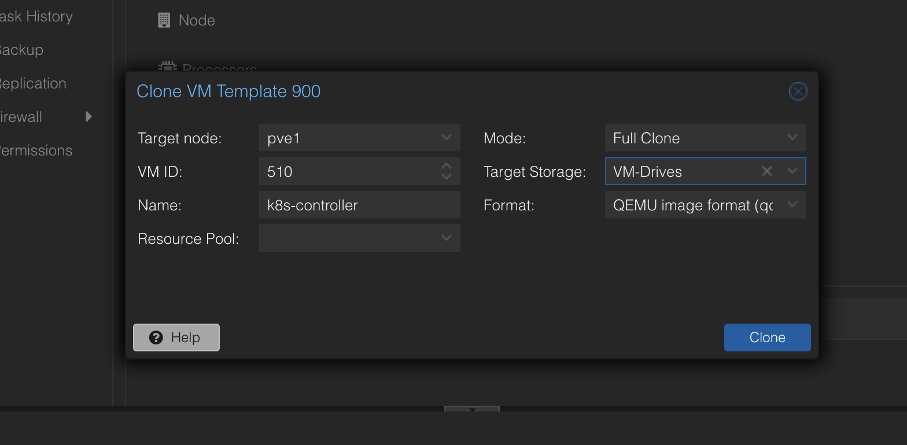
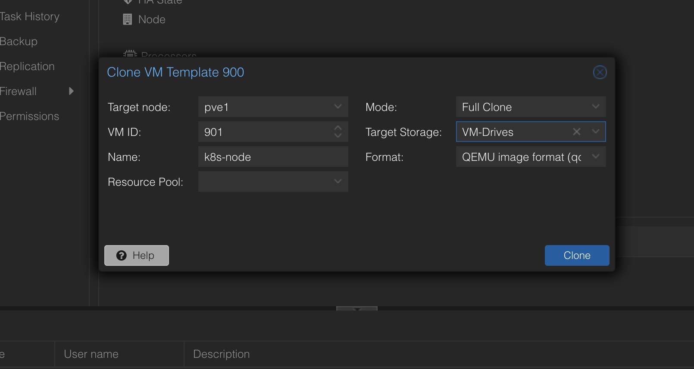
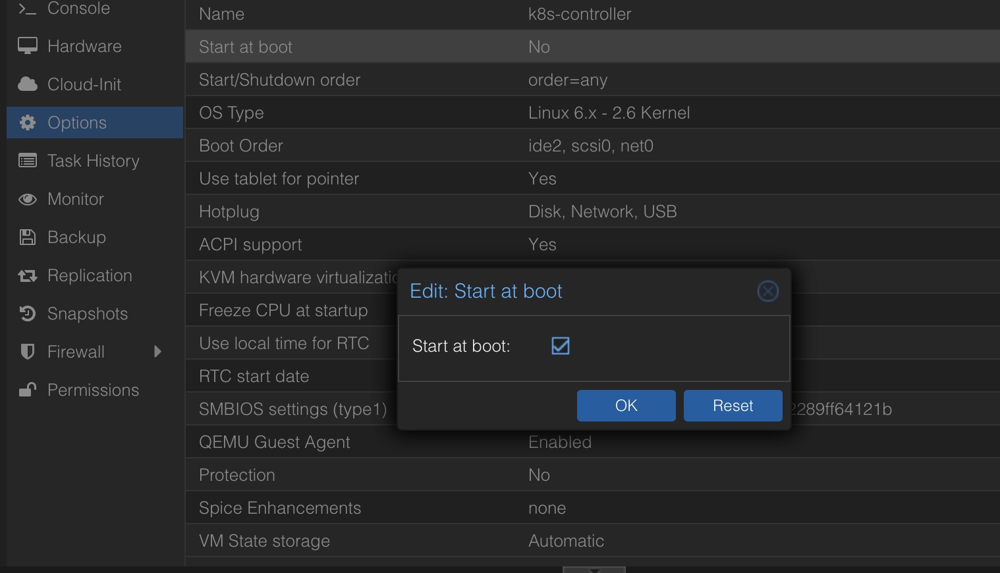
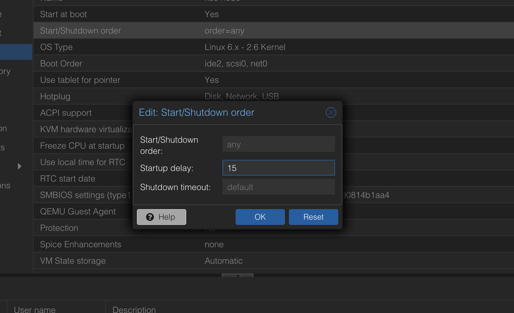
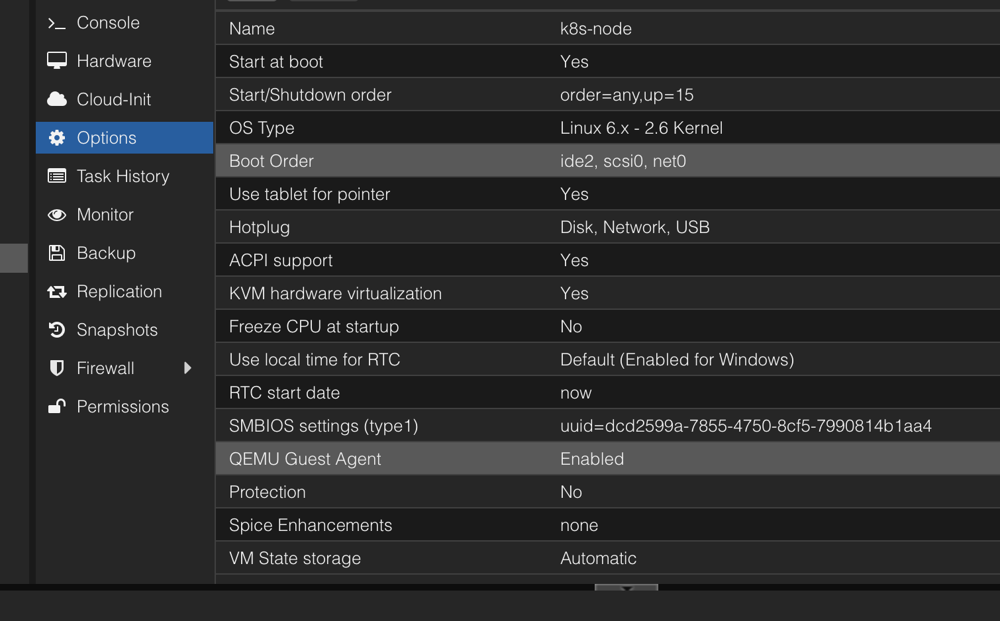
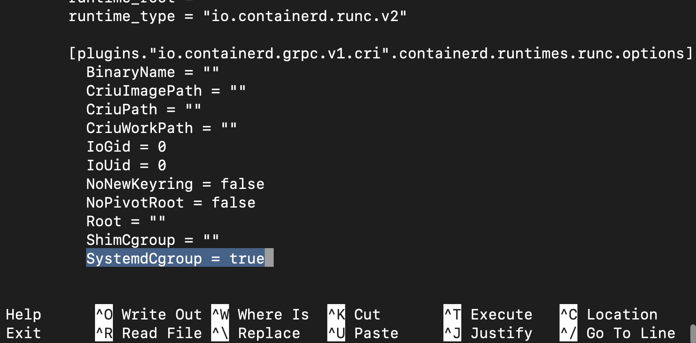
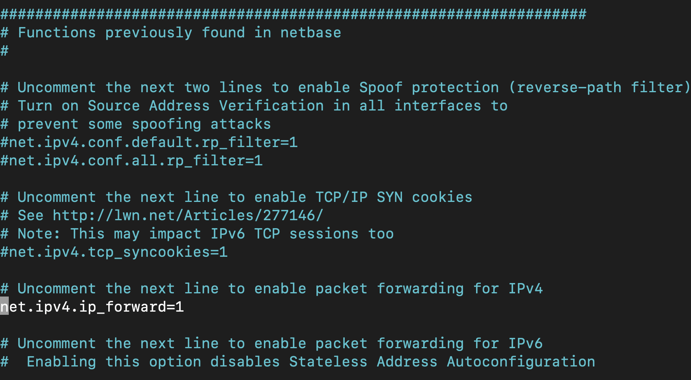
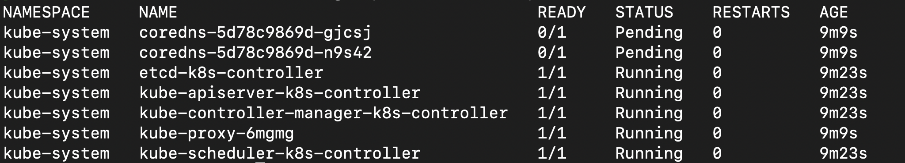
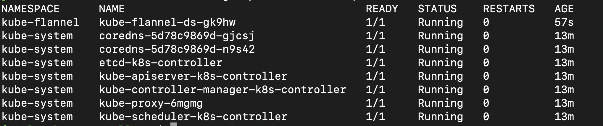
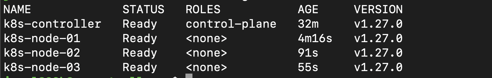

# Kubernetes Cluster in Proxmox
#Proxmox #Virtualization #Linux #Kubernetes

Source:
[How to Build an Awesome Kubernetes Cluster using Proxmox Virtual Environment](https://www.youtube.com/watch?v=U1VzcjCB_sY&t=1044s)

## Introduction
This Kubernetes cluster will consist of four VMs, one of them will act as the Controller and the other three will act as Nodes. These VMs are all going to be clones of an Ubuntu 22.04 Template I had previously created. Here is how you can create VM Templates in Proxmox [[Templates (VMs)]]

## Initial Setup
1. We are going to start by creating two clones `k8s-controller` and `k8s-node`.




2. Make sure both this clones are set to start when the Promox server boots up.


3. Set Start/Sutdown order so the node starts with a 15 seconds delay as to ensure the controller boots up before the node does.


4. Make sure the QEMU Guest Agent is Enabled on both VMs.


5. Start the VMs.
6. Log in to the VMs and install the `qemu-guest-agent`
```bash
sudo apt install qemu-guest-agent
```

7. Finally, reboot them.


## Further adjustments

1. Log in to each instance.
2. Update packages and install updates:
```bash
sudo apt update && sudo apt dist-upgrade
```

3. Set up DHCP Static Leases for these two VMs or configure Static IPs [[Network Settings in Ubuntu Server#^035879]]
4. Make sure the Hostname is set in both VMs.
```bash
cat /etc/hostname
```
```bash
cat /etc/hosts
```


## Set up the Container Runtime

1. Run the following command on both instances:
```bash
sudo apt install containerd
```

You can check if `containerd` is running with:
```bash
systemctl status containerd
```

2. Create a new directory:
```bash
sudo mkdir /etc/containerd
```

3. Generate the default configuration for containerd:
```bash
containerd config default | sudo tee /etc/containerd/config.toml
```

4. Edit the config file as follows:
```bash
sudo nano /etc/containerd/config.toml
```




5. Ensure that Swap is disabled.
```bash
free -m
```

If Swap is enabled in your case, you can disable it by editing the `/etc/fstab` file. Just comment out the line where Swap is declared.

6. Edit the `/etc/sysctl.conf`:
```bash
sudo nano /etc/sysctl.conf
```

We will enable bridging by uncommenting this line


7. Create the following file:
```bash
sudo nano /etc/modules-load.d/k8s.conf
```

inside this file, type:
```
br_netfilter
```
This is to ensure bridging is fully supported within the cluster

8. Reboot the VMs

## Install Kubernetes
1.  Add the GPG key required for intalling the packages:
```bash
sudo curl -fsSLo /usr/share/keyrings/kubernetes-archive-keyring.gpg https://packages.cloud.google.com/apt/doc/apt-key.gpg
```

2. Install the repository.
```bash
echo "deb [signed-by=/usr/share/keyrings/kubernetes-archive-keyring.gpg] https://apt.kubernetes.io/ kubernetes-xenial main" | sudo tee /etc/apt/sources.list.d/kubernetes.list
```

3. Install the packages.
```bash
sudo apt update
```

```bash
sudo apt install kubeadm kubectl kubelet
```


## Create a Template from which we can clone nodes
1. Log in to your node instance and run the following commands:
```bash
sudo cloud-init clean
```

```bash
sudo rm -rf /var/lib/cloud/instances
```

```bash
sudo truncate -s 0 /etc/machine-id
```

```bash
sudo rm /var/lib/dbus/machine-id
```

```bash
sudo ln -s /etc/machine-id /var/lib/dbus/machine-id
```

2. Shutdown the node instance.
3. Convert into a template. [[Templates (VMs)#^273ddd]]

## Clone nodes
From the Template we just have created, clone as many nodes as you want your cluster to have.


## Resource Allocation
- For the controller
	at least 2048GB of RAM
	at least 2 CPUs

- For the nodes
	You can leave them with the default. You can adjust these values as needed.

Power off the VMs and edit these values under the 'Hardware' menu for each individual VM.


## Initialize the Kubernetes Cluster
1. Power back on all VMs.
2. Log in to the controller and run the following command. Bear in mind that this command will be slightly different in your case. Paste the IP address that correspond to your `k8s-controller` on the `--control-plane-end-point`. Also make sure that you match the hostname of your controller on the `--node-name` option.
```bash
sudo kubeadm init --control-plane-endpoint=10.1.20.29 --node-name k8s-controller --pod-network-cidr=10.244.0.0/16
```

The output of this command contains a join command that you will use for joining nodes to this cluster. Copy this command and keep it aside. ^7bb295

Note: if for any reason you make a mistake in this step, you can revert back by running:
```bash
sudo kubeadm reset
```
Edit the init comand and run it once again.

3. Next, run the following commands on the controller, as required in the output of the previous command:
```bash
mkdir -p $HOME/.kube
```

```bash
sudo cp -i /etc/kubernetes/admin.conf $HOME/.kube/config
```

```bash
sudo chown $(id -u):$(id -g) $HOME/.kube/config
```
``
These command will give our local user access to the cluster.

4. Now run:
```bash
kubectl get pods --all-namespaces
```

Notice here that our coredns pods appear as penning:


Run the following command to fix this:
```bash
kubectl apply -f https://raw.githubusercontent.com/flannel-io/flannel/master/Documentation/kube-flannel.yml
```

After a couple of seconds all pods should be running



## Join Nodes to the cluster
1. We are going to start by running:
```bash
kubectl get nodes
```
You should only see the controller at this point.

2. Log in to your nodes and run the join command previously obtained. [[Kubernetes Cluster in Proxmox#^7bb295]]

Note: There is a chance that you get an error when running this command, and the most likely reason is that too much time has passed and the token has expired. To fix this you can run the following command on the controller instance:
```bash
kubeadm token create --print-join-command
```

The output of this command should look something like this:
```bash 
kubeadm join 10.2.1.179:6443 --token tb33uk.13of3gr1oi17jmku --discovery-token-ca-cert-hash sha256:72f00bc8c5e04154018c9b75720b908eee07bb6949d75b0b38fe2df5f2da3876
```

3. Run the join command superseded by `sudo` on all the nodes
4. Check if the nodes have been adddes to the cluster. From the controller instance run:
```bash
kubectl get nodes 
```



