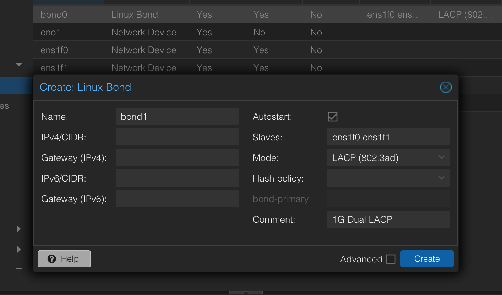

# Setting up bond interface for Link Aggregation
#Proxmox #Virtualization #Networking 

## GUI method (Recommended)
1. Select the node, and under System > Network, click on "Create", then select "Linux Bond".
2. In the next window, configure the bond interface as follows:
 
	2.1. Give the bond interface a name, in this case I have named it `bond1`. 
	2.2 Under "Slaves", write the name of the interfaces you are bonding, separated by a space. 
	2.3 LACP (802.3ad) mode will allow for multi VLAN traffic (LAG).


## Manual method

1. Open a terminal session on your PVE node
2. Then, open and edit `/etc/network/interfaces`
```bash
nano /etc/network/interfaces
```

 and add the following lines:
```/etc/network/interfaces
auto eno1
iface eno1 inet manual

auto eno2
iface eno2 inet manual

auto bond0
iface bond0 inet manual
		bond-slaves eno1 eno2
		bond-miimon 100
		bond-mode 802.3ad
		bond-xmit-hash-policy layer3+4
```

3. Now add a new bridge config
```etc/network/interfaces
auto eno1
iface eno1 inet manual

auto eno2
iface eno2 inet manual

auto bond0
iface bond0 inet manual
		bond-slaves eno1 eno2
		bond-miimon 100
		bond-mode 802.3ad
		bond-xmit-hash-policy layer3+4

auto vmbr1
iface vmbr1 inet manual
        bridge-ports bond0
        bridge-stp off
        bridge-fd 0
        bridge-vlan-aware yes
        bridge-vids 2-4094
		
```

4. Apply changes
```bash
ifreload -a
```