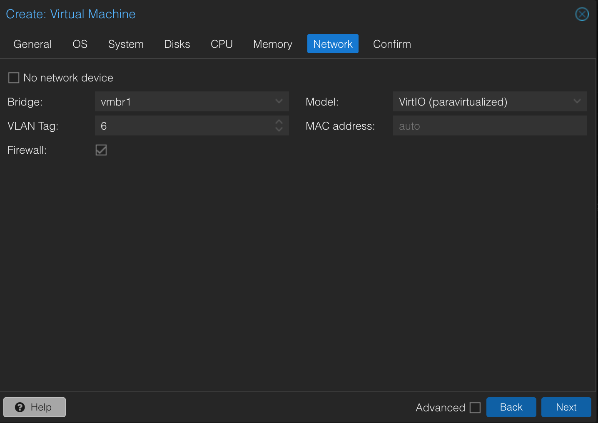
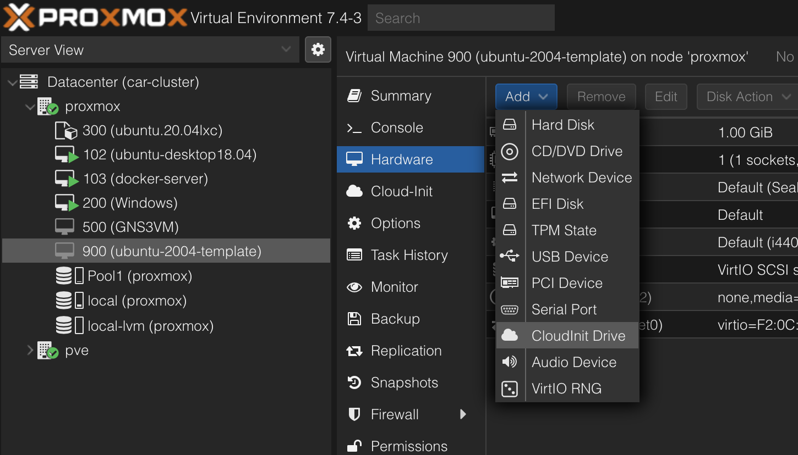
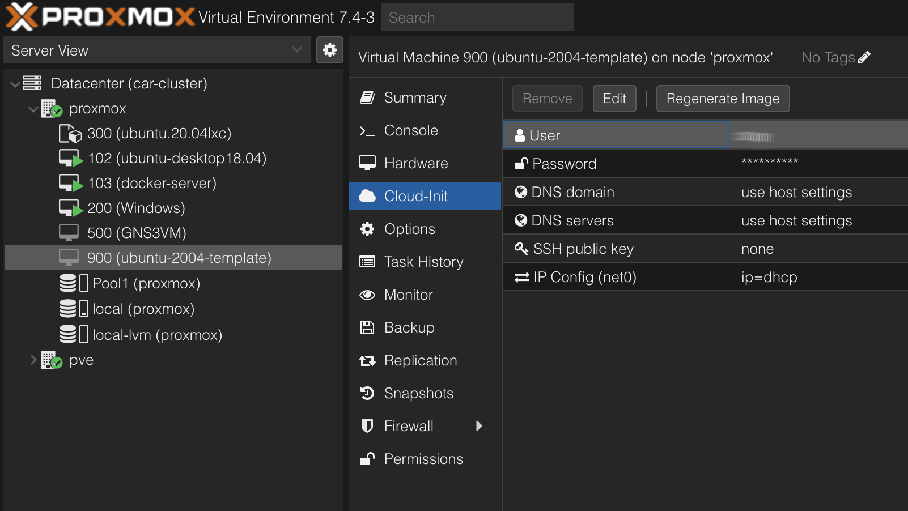
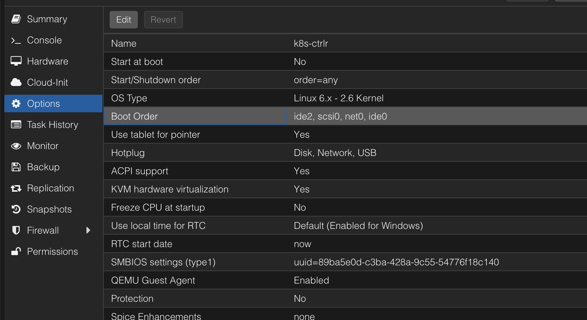
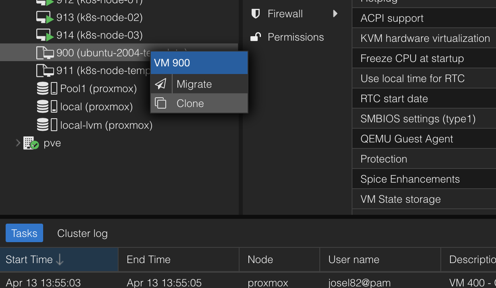

# Templates (VMs) UEFI
#Proxmox #Virtualization #Linux 

This template is built for systems running UEFI instead of Legacy BIOS. The process is quite similar, just a few options need to be adjusted.


## Create a new virtual machine 

1. Give the VM a name and an ID


2. Next, select 'Do not use any media' 


3. Here is where the process starts to differ. Select `q35` in the **Machine** dropdown menu. Then select `OVMF (UEFI)` as BIOS. You will need to add an EFI Disk. Select the target storage pool and keep the format as `qcow2`. Leave the SCSI Controller as `VirtIO SCSI single` (this is the fastest option). Finally check the Qemu Agent option. 


4. Under 'Disks', delete the default disk. We will be importing a disk image.


5. The amount of cores you define on this tab will translate to the maximum amount of threads the hypervisor will allocate to the VMs on a given time. This threads are allocated dynamically by the system, meaning that the VM share these threads with other VMs or even the system itself.
    The recommended CPU cores for any given VM is 4 cores; However, in this example I will allocate only 2 cores. This value can be adjusted after if required.

	As for CPU type, I will leave it at the default value of `kvm64`. NOTE: Proxmox version 8 comes with the `(x86-64-v2-AES)` option, which would work much better with my particular system, but since I am currently running version 7.4-16 on my server, I don't have it available.


6. Give this template at least 2048MB of RAM. You can increase the memory on each individual clone if required.


7. Select the appropriate bridge interface and VLANs. This will define the LAN where the VMs are connected to by default.


8. Check that all the setting are correct and click on 'Finish'.

## Add a Cloud-Init drive
1. Select the newly created VM. On the Menu, select 'Hardware', then click on 'Add', then select 'CloudInit Drive'.


2. (IMPORTANT!) Make sure you select `SCSI` as Bus/Device type in this step. If you leave it to the default `IDE`, the cloud-init drive won't load properly, causing issues when booting the VMs.


## Set up Cloud-Init user and password.
Here you can add a SSH Public Key if you have generated one. You can also set the VM to obtain an IP address via DHCP under the 'IP Config' option.


## Import Cloud-Init image
In this example, I am going to be using Ubuntu 20.04 minimal focal as the OS version of my Cloud-Init image.

1. Open this [link](https://cloud-images.ubuntu.com/minimal/releases/focal/release/) on a web browser and copy the link of the image. Copy the Link address of the cloud-init image. It is the file with the `.img` file extension.


2. Log in to your Proxmox node terminal and download the images as follows:
```bash
wget https://cloud-images.ubuntu.com/minimal/releases/focal/release/ubuntu-20.04-minimal-cloudimg-amd64.img
```


3. Chance the file extension of the image to `.qcow2`
```bash
mv ubuntu-20.04-minimal-cloudimg-amd64.img ubuntu-20.04-minimal-cloudimg-amd64.qcow2
```

4. Resize the image. I will allocate a maximum of 80GB storage capacity. This will of course be allocated dymicaly, meaning that the virtual disk will grow as it fills up.
```bash
qemu-img resize ubuntu-20.04-minimal-cloudimg-amd64.qcow2 80G
```

5. Import disk into the VM.
```bash
qm importdisk 900 ubuntu-20.04-minimal-cloudimg-amd64.qcow2 <local-storage>
```

6. Create a VGA console for the VM .
```bash
qm set 900 --serial0 socket --vga serial0
```

7. Attach the disk image into the VM. 
On the Web UI, select the VM and under 'Hardware' you will see an 'Unused' virtual disk. Select the disk, then click on 'Edit', finally click on 'Add'.

8. Edit the boot order.
Under 'Options', select 'Boot Order' and click on 'Edit'.


Drag the 'scsi0' disk to the second position and click OK


## Convert the VM into a Template
Right click on the VM, then click on 'Convert to template'.
 ^273ddd


## Crate a Full Clone of the template
1. Right click on the template. Select 'Clone'.


2. Give the clone a name and ID. Set the Mode as 'Full Clone'. Select your Target Storage, then click on 'Clone'.


3. Start the Clone

## Install qemu agent on the clone
1. Once started, log in to the clone's terminal and run the following command:
```bash
sudo apt install qemu-guest-agent
```

2. Reboot the VM

