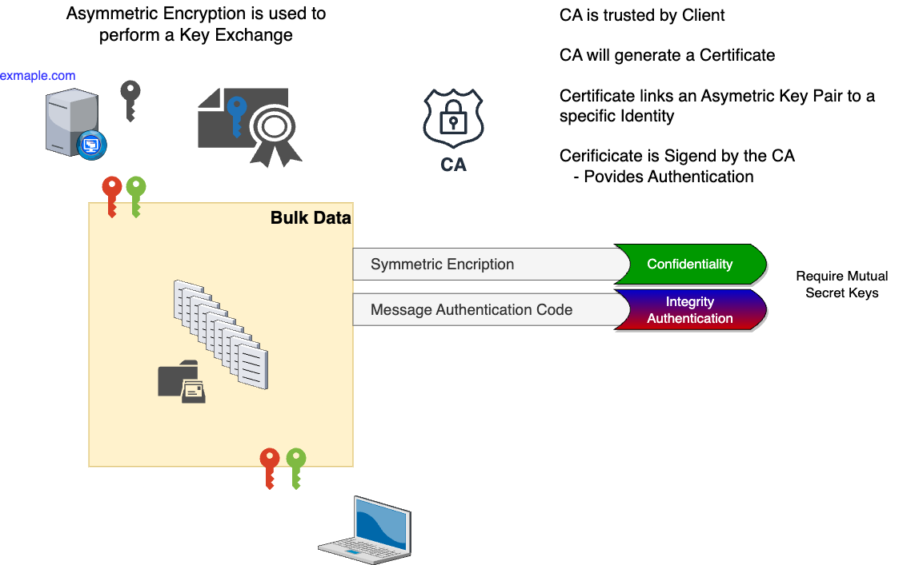

# SSL-TLS
#IT #CyberSecurity 

(SSL) Secure Socket Layer
(TLS) Transport Layer Security
These two names are often used interchangeably. SSL was originally developed by Netscape in 1994 and has been upgraded along the years, until in 1999 after another upgrade that it was named TLS. As of 2023, the latest version of TLS is v1.3; However, TLS v1.2 still remains the most used version of TLS.

## Definitions:
The goal of TLS is to provide:

- **Confidentiality:** data is only accessible by the client and the server. It is provided with encryption
- **Integrity:** Data is not modified between the client and the server. It is provided with hashing.
- **Authentication:** Client/Server are indeed who they say they are. it is provided with Public Key Infrastructure (PKI)

- **Anti-Reply:** provided with built-in sequence numbers.
- **Non-Repudiation:** sender cannot later deny sending a message.

SSL/TLS ecosystem involves three kay players:
- **Client:** the entity initiating the TLS Handshake. E.g. Web Browser (optionally authenticated "rare").
- **Server:** the entity receiving the TLS Handshake. E.g. Web Server (Always authenticated).
- **Certificate Authority (CA):** the governing entity that issues certificates. Trusted by client and server. Provides the trust anchor. If we trust the CS, we trust what the CA tursts.

## Hashing
It is an algorithm which takes as input a message of arbitrary length and produces as output a **fingerprint** of the original message.

The result of the hashing algorithm is called a **digest**. It is also called: checksum, fingerprint, hash, CRC, etc...

If the original data is changed, the resulting digest will be different.

Hashing algorithms must satisfy four requirements:
- Imposible to produce a given digest.
- Imposible to extract original message.
- Slight changes produce drastic differences.
- Resulting digest is of fixed width (length).

Common hashing algorithms:

| **Algorithm** | **Digest length** |
|---|---|
| MD5 | 128 bits |
| SHA/SHA1 | 160 bits |
| SHA2 family: | |
| SHA-224 | 224 bits |
| SHA-256 | 256 bits |
| SHA-384 | 384 bits |
| SHA-512 | 512 bits |

### Data integrity
- Hashing is used to provide integrity. 
- Both parties establish a mutual secret key. 
- Sender combines Message + Secret Key to create a digest.
- Receiver verifies by calculating the hash of the message + Secret Key

#### Message Authentication Code (MAC)
- Concept of combining Message + Secret Key when calculating a digest.
- It provides integrity and authentication for Bulk Data Transfer.
- Hash Based Message Authentication Code (HMAC) is the industry standard of MAC

## Encryption
It is used to provide confidentiality

**Plain text:** Data before encryption and after decryption.
**Cipher text:** Data while encrypted.

**Simple encryption:** Transform plain text into cipher text.
- Doesn't scale.
- Hard to do securely.
- Cannot simply use a standard algorithm.

**Key Based encryption:**
- Combines industry vetted algorithm with a secure key.
- Algorithm is created by experts.
- Secret keys can be randomly generated.

### Symmetric Encryption
- Encrypts and decrypts using the same key.
	**Strengths:**
	- Faster - Lower CPU cost.
	- Cipher text is same size as plain text.
	**Weaknesses:**
	- Secret key must be shared - Less secure.
- Ideal for Bulk data

| **Algorithm** | **Key size** | |
|---|---|---|
| DES | 56 bits | Insecure |
| RC4 | 128 bits | Insecure |
| 3DES | 168 bits | Not very secure |
| AES | 128, 192 or 256 bits | Secure |
| ShaSha20 | 128 or 256 bits | Secure |

## Asymmetric Encryption
- Encrypts and decrypts using different keys.
- These two keys are mathematically related.
	- What one key encrypts the other key decrypts.
	- One key will be made Public.
	- The other key will be kept private.
	**Strengths:**
	- Private key is never shared.
	**Weaknesses:**
	- Slower - requires much larger key sizes.
	- Cipher text expansion.
- Restricted to Limited Data
- Algorithm
	- DSA (Not very secure)
	- RSA (Recommended key size: 2048)
	- Diffie-Hellman
	- ECDSA
	- ECDH

Asymmetric Key Pairs can provide Encryption and Signatures
- **Encryption:** the sender encrypts a message with the receiver's public key. This message can only be decrypted by the receiver, because the receiver is the only person that has the private key. This method provides **Confidentiality**.
- **Signature:** in this case the sender encrypts a message with their private key, which can only be decrypted with the sender's public key. This is used for providing **Authentication** and **Integrity**.

Since Asymmetric Encryption can't be used for bulk data, but can be used for limited data, and bulk data should be protected with Symmetric Encryption. We can use Asymmetric Keys to share Symmetric Keys.

### Hybrid Encryption
Is the concept of using both Asymmetric and Symmetric encryption.
- Asymmetric Encryption is used to facilitate a key exchange.
- A Secret Key used with Symmetric Encryption to encrypt bulk data. 

Process for using an Asymmetric Key pair for Signatures:
- The sender calculates a hash of a message.
- The sender encrypts the resulting digest with their private key.
- The receiver decrypts the signature with the sender's public key.
- The receiver calculates the hash of the received message.
	- If both digests match, this proves:
	- that the message hasn't changed since the sender signed it (Integrity).
	- that only the sender could have created the signature (Authentication).

Many Items can be signed: Messages, Certificates, Software, Email, etc...

Client, Server and CA for the Public Key Infrastructure Triangle (PKI) 

- **Client** - needs to connect securely or verify an identity
- **Server** - needs to prove its identity
- **Certificate Authority** - validate identity & generates certificates

## TLS sequence  
1. The **Certificate Authority** is the cornerstone of the SSL/TLS process.
	- The CA has a Public Key and a Private Key
	- It also has a Self-Signed-Certificate

2. The **Server** wants to acquire a Certificate so it can proof its identity.
3. The **Server** generates a Public Key and a Private Key.
4. The **Server** generates a Certificate Signing Request (CSR).
	- The CSR contains the Server's Public Key
	- It is also signed by the Server's Private Key

5. The **Server** will then submit the signed CSR to the Certificate Authority (CA).
6. The **CA** inspects and validates the information contained in the CSR.
7. The **CA** issues a Certificate using the information in the CSR (The Server's Public Key). 
8. The **CA** then signs this Certificate with the CA's Private Key.
9. The **CA** gives the Certificate to the Server.
10. The **Server** can then provide this Certificate to prove its identity.
11. The **Client** wants to connect to the Server securely.
	- The Web Browsers already have CA Certificates installed.

12.  The **Client** requests the Server's Certificate.
	- It validates that the Certificate is legitimate
	- It validates that the Server truly owns the Certificate

13. The **Client** validates the Server's Certificate in the SSL/TLS Handshake. 
14. SSL/TLS Handshake produces Session Keys.
	- One set of Symmetric Encryption keys provide Confidentiality
	- One set of Symmetric Message Authentication Code (MAC) keys to provide Integrity and Authentication.

15. These Session Keys form a Secure Tunnel to protect communication.

## Cipher Suite
It is a suits of protocols that are agreed upon between Client and Server in order to achieve the following items:

- Key Exchange
	ECDHE
	DHE
	ECDH
	DH
	RSA
	PSK
- Authentication
	ECDSA
	RSA
	DSS
	PSK
- Encryption
	CHACHA20
	AES-256-GCM
	AES-128-GCM
	AES-256-CBC
	AES-128-CBC
	3DES-CBC
	RC4-128
	DES-CBC
- Hashing
	Poly1305
	SHA384
	SHA256
	SHA
	MD5

Some examples of cipher suites:
[Source:](https://www.iana.org/assignments/tls-parameters/tls-parameters.xhtml)
TLS_NULL_WITH_NULL_NULL
TLS_RSA_WITH_NULL_MD5
TLS_RSA_WITH_NULL_SHA
TLS_RSA_EXPORT_WITH_RC4_40_MD5
TLS_RSA_WITH_RC4_128_MD5
TLS_DH_DSS_WITH_DES_CBC_SHA
TLS_DHE_DSS_EXPORT_WITH_DES40_CBC_SHA
TLS_DH_DSS_WITH_AES_128_CBC_SHA256